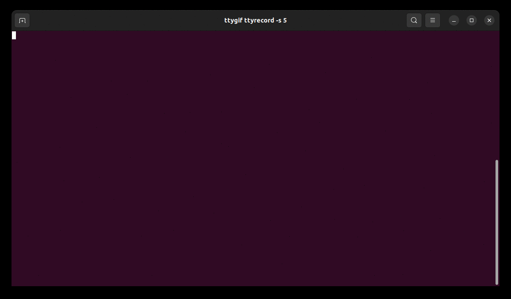
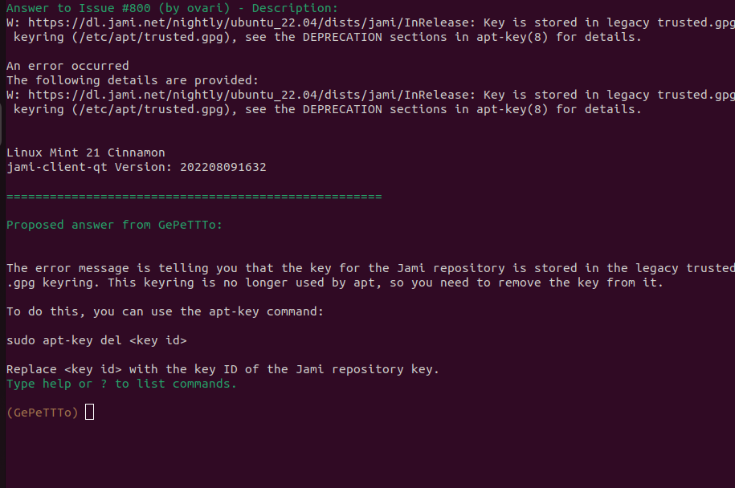
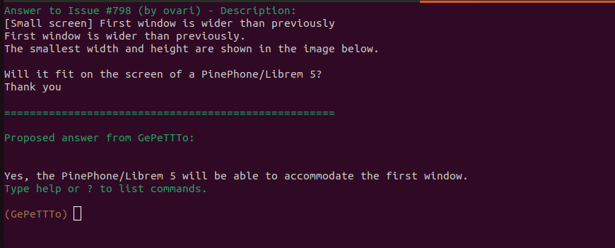

# GepeTTTo

A simple GitLab bot working with GPT-3

## Preparation

### GitLab's token

Go to your GitLab's instance (https://<YOUR_GITLAB>/-/profile/applications) and generate a new token with `api`/`read_api`'s permissions.

### GPT-3's token

To get your GPT-3 token, connect to your OpenAI's account and generate a new token from this page: https://beta.openai.com/account/api-keys

### Prepare the environment file

Then, you simply need to create the environment file (default: `env`) like so:

```
OPENAI_API_KEY=YOUR_OPENAI_API_KEY
OPENAI_MODEL=YOUR_OPENAI_API_MODEL #text-davinci-002 if not customized
GITLAB_API_KEY=YOUR_GITLAB_API_KEY
GITLAB_ENDPOINT=YOUR_GITLAB_INSTANCE
GITLAB_USERS=COMMA_SEPARATED_USERS # Optional, if you want to train a custom model, e.g. 9,3,233
```

You also need to install `termcolor` (`pip3 install termcolor`), `bs4` (`pip3 install bs4` and `pip install lxml`) and `markdown` (`pip3 install markdown`).

Finally you will need OpenAI's library: `pip install openai`

## Usage

### Generate a new training dataset

```
make dataset
```

will use `src/gpt3-make-dataset.py` to create a new training dataset from your GitLab's instance

### Train a new model

```
make train
```

will run `src/train-openai.sh` with default parameters.

However, text-davinci-002 seems to be not customizable and get way better results than davinci (which can be customized). So for now, not sure if it's wanted.

### Use it

```
make answer
```

will run `src/answer-last.py` to gather last issues and answer it.

## NOTE

Code in this directory is under BSD-3 License, rsc/custom.jsonl is mostly generated from the FAQ
from docs.jami.net (under GNU Free Documentation License v1.3) or my own comments.

## Demo





